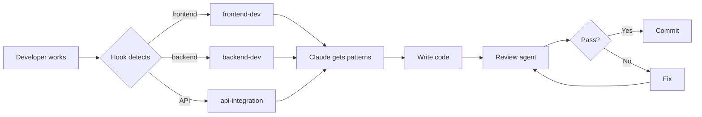

# Super Feynman

AI-Powered Learning Through the Feynman Technique

<div class="mt-8 px-8 py-3 bg-orange-600 text-white rounded-lg inline-block font-bold">
  🏆 Best Use of Claude Track
</div>

<div class="mt-8 text-gray-600 text-sm">
  CBC Hackathon 2024 | Solo Project
</div>

<div class="abs-br m-6 flex gap-2">
  <a href="https://github.com/KVon16/Super-Feynman" target="_blank" class="slidev-icon-btn">
    <carbon:logo-github />
  </a>
</div>

<!--
Welcome everyone! Today I'm presenting Super Feynman, an AI-powered learning application built for the Best Use of Claude track.

This is a solo hackathon project that showcases not just how Claude can power innovative learning experiences, but also how Claude Code can revolutionize the development process itself.
-->

---
layout: default
---

# The Problem

<div class="grid grid-cols-2 gap-8 mt-8">

<div>

## Students Struggle to Truly Understand

<v-clicks>

- 📚 **Memorization ≠ Understanding**
  - Can recall facts but can't explain concepts
  - The "illusion of knowledge"

- 🤔 **The Feynman Test**
  - *"If you can't explain it simply, you don't understand it well enough"*
  - — Richard Feynman

- 😓 **Current Pain Points**
  - No structured way to practice explaining
  - No feedback on explanation quality
  - Hard to identify knowledge gaps

</v-clicks>

</div>

<div class="flex items-center justify-center">
  <div class="text-center">
    <div class="flex items-center justify-center gap-6">
      <div class="text-8xl">🧠</div>
      <div class="text-4xl text-gray-400">→</div>
      <div class="text-8xl">💡</div>
    </div>
    <div class="mt-6 text-sm text-gray-500">From confusion to clarity</div>
  </div>
</div>

</div>

<!--
The core problem: students can memorize information but struggle to truly understand it.

The Feynman Technique says: if you can't explain it simply, you don't really understand it.

But there's no easy way to practice explaining concepts and get feedback on your understanding.
-->

---
layout: default
---

# The Solution: Super Feynman

<div class="mt-8">

## AI-Powered Conversational Practice

<v-clicks>

### 🎯 Core Features

1. **📝 Auto Concept Extraction** — Upload lecture notes → AI extracts 5-15 key concepts
2. **👥 Multi-Level Audiences** — Practice explaining to:
   - Classmate (college peer)
   - Middle Schooler (12-14 years old)
   - Kid (5-8 years old)
3. **💬 Interactive Review Sessions** — Back-and-forth conversation with Claude
4. **📊 Detailed Feedback** — Analysis of clarity, jargon usage, and knowledge gaps
5. **📈 Progress Tracking** — Not Started → Reviewing → Understood → Mastered

</v-clicks>

</div>

<!--
Super Feynman provides a complete AI-powered practice system.

Upload your lecture notes, and Claude extracts the key concepts you need to master.

Then you explain each concept to different audience levels, having a real conversation with Claude.

You get detailed feedback on what was clear, what was unclear, and where your gaps are.

And you track your progress as you master each concept.
-->

---
layout: two-cols
layoutClass: gap-8
---

# Tech Stack

## Application

<div class="mt-3 space-y-2 text-sm">

**Frontend**
- ⚛️ React 18 + TypeScript
- 🎨 Tailwind CSS
- 🚀 Vite

**Backend**
- 🟢 Node.js + Express
- 🗄️ SQLite

**AI Services**
- 🤖 **Claude Sonnet 4.5**
  - Concept generation
  - Conversational review
  - Feedback analysis
- 🎤 **OpenAI Whisper**
  - Speech-to-text

</div>

::right::

## Development Stack

<div class="mt-3 space-y-1 bg-orange-50 p-3 rounded-lg border-2 border-orange-400 text-gray-800">

<div class="text-orange-600 font-bold text-sm mb-2">⭐ The Innovation</div>

<div class="text-gray-900 font-semibold text-xs">Built With Claude Code</div>

<div class="text-gray-800 text-xs">

- 🔧 Skill activation
- 📚 Progressive disclosure
- 🔍 Review agents
- 🪝 Hook automation

</div>

<div class="mt-3 p-2 bg-white rounded border border-orange-200">
  <div class="text-xs font-mono text-gray-700">
    "Built WITH Claude,<br/>
    Powered BY Claude"
  </div>
</div>

</div>

<!--
The tech stack is straightforward full-stack TypeScript.

But here's what makes this special for the "Best Use of Claude" track:

Not only does Claude power every AI feature in the app, but I also built the entire application using Claude Code with a custom development workflow.

I created specialized skills and automated code review agents that ensured architectural consistency throughout development.
-->

---
layout: default
---

# Claude Powers the Learning Experience

<div class="grid grid-cols-3 gap-3 mt-3">

<div class="bg-gradient-to-br from-blue-50 to-blue-100 p-3 rounded-lg text-gray-800">

<h3 class="text-gray-900 font-bold mb-2">1️⃣ Concept Generation</h3>

```md
Prompt: "Break down lecture
notes into 5-15 concepts.
Return as JSON."
```

**Result:** <10s processing

</div>

<div class="bg-gradient-to-br from-purple-50 to-purple-100 p-3 rounded-lg text-gray-800">

<h3 class="text-gray-900 font-bold mb-2">2️⃣ Conversational Review</h3>

```md
System: "Help student explain
[CONCEPT] to [AUDIENCE_LEVEL].
Ask probing questions."
```

**Result:** Adaptive questioning

</div>

<div class="bg-gradient-to-br from-green-50 to-green-100 p-3 rounded-lg text-gray-800">

<h3 class="text-gray-900 font-bold mb-2">3️⃣ Feedback Analysis</h3>

```md
Prompt: "Analyze session:
1) Quality
2) Clear/unclear parts
3) Jargon, struggles
Return JSON."
```

**Result:** Actionable insights

</div>

</div>

<div class="mt-3 text-center text-sm text-gray-600">
  Claude Sonnet 4.5 handles all three use cases with sophisticated understanding
</div>

<!--
Let me show you how Claude powers the learning experience.

First, concept generation: I send lecture notes to Claude with a structured prompt, and it extracts 5-15 key concepts in under 10 seconds.

Second, conversational review: Claude adapts to the audience level and asks probing questions to test understanding - not just yes/no questions.

Third, feedback analysis: After the conversation, Claude analyzes the entire session and provides structured feedback on what was clear, what was unclear, jargon usage, and specific struggles.

All three use cases leverage Claude Sonnet 4.5's deep understanding capabilities.
-->

---
layout: default
---

# The Real Innovation: Development Workflow

<div class="grid grid-cols-2 gap-6 mt-4">

<div>

## Traditional Development

<v-clicks>

<div class="space-y-2 text-sm">

- ❌ Constant context switching
- ❌ Searching for patterns
- ❌ Inconsistent code reviews
- ❌ Tech debt accumulation

</div>

</v-clicks>

<div class="mt-6 text-gray-500 text-center text-sm">
  😓 Slow, error-prone, inconsistent
</div>

</div>

<div class="bg-gradient-to-br from-orange-50 to-orange-100 p-4 rounded-lg border-2 border-orange-400 text-gray-800">

## My Solution: Skill Activation

<v-clicks>

<div class="space-y-1 text-sm">

- ✅ **Auto Context Injection**
  - Hooks detect file type, activate skill

- ✅ **Progressive Disclosure**
  - Project patterns on-demand

- ✅ **Specialized Agents**
  - code-architecture-reviewer
  - Catches issues pre-commit

</div>

</v-clicks>

<div class="mt-2 p-2 bg-white rounded border border-orange-300">
  <div class="text-xs font-bold text-orange-600">Fast, consistent, minimal debt</div>
</div>

</div>

</div>

<!--
Here's where it gets really interesting.

Traditional development with AI assistants involves constant context switching - you're always searching docs, looking up patterns, and doing manual code reviews.

I built a skill activation system that solves this.

When I work on a file, hooks automatically detect what I'm doing and inject the right context - frontend patterns, backend architecture, API integration guides.

And then a specialized code-architecture-reviewer agent reviews my code to catch issues before I even commit.

This resulted in fast development with consistent patterns and minimal technical debt.
-->

---
layout: default
---

# How Skill Activation Works

<div class="flex justify-center mt-2">



</div>

<div class="grid grid-cols-3 gap-3 mt-3">

<div class="bg-blue-50 p-3 rounded text-gray-800">
  <div class="font-bold text-blue-600 text-sm">frontend-dev</div>
  <div class="text-xs mt-1">React 18, Tailwind patterns</div>
</div>

<div class="bg-purple-50 p-3 rounded text-gray-800">
  <div class="font-bold text-purple-600 text-sm">backend-dev</div>
  <div class="text-xs mt-1">Express, SQLite architecture</div>
</div>

<div class="bg-green-50 p-3 rounded text-gray-800">
  <div class="font-bold text-green-600 text-sm">api-integration</div>
  <div class="text-xs mt-1">Claude & Whisper APIs</div>
</div>

</div>

<!--
Here's the actual workflow in action.

When I edit a frontend file, the hook triggers and activates the frontend-dev skill. Claude immediately has access to all my React patterns, Tailwind conventions, and component organization.

Same for backend - it knows the Express architecture, SQLite patterns, and error handling approaches.

Then before committing, the code-architecture-reviewer agent examines everything for best practices and system integration.

I created three specialized skills for this project, and they work seamlessly together.
-->

---
layout: center
class: text-center
---

# Live Demo

<div class="mt-8 text-xl text-gray-600">
  Let me show you Super Feynman in action
</div>

<div class="mt-4 text-sm text-gray-500">
  (Running locally at localhost:5173)
</div>

<!--
Now let me show you the actual application.

DEMO FLOW (7 minutes total):

MINUTE 1-2: Core Learning Flow
1. Show home screen with courses
2. Click into "CS 101 - Data Structures" course
3. Click "Add Lecture"
4. Upload sample lecture notes (binary_search_trees.txt)
5. Watch Claude extract concepts in real-time
6. Show the concept list with progress badges

MINUTE 3-5: Review Session
7. Click on "Binary Search Trees" concept
8. Select audience level: "Middle Schooler"
9. Type or speak explanation using microphone
10. Show Claude's follow-up questions
11. Continue for 2-3 exchanges
12. Click "End Session"

MINUTE 6-7: Feedback & Progress
13. Show "Analyzing session..." loading
14. Display feedback screen:
    - What was clear
    - What was unclear
    - Jargon detected
    - Progress update (Not Started → Reviewing)
15. Show updated concept with new progress badge
-->

---
layout: two-cols
layoutClass: gap-8
---

# Demo Highlights

## What You Just Saw

<v-clicks>

<div class="space-y-3 text-sm">

### ✨ Seamless UX
- Upload → instant extraction
- Natural conversation
- Real-time transcription
- Progress tracking

### 🤖 Claude Intelligence
- Concept parsing
- Adaptive questioning
- Nuanced feedback
- Audience-appropriate

</div>

</v-clicks>

::right::

## Technical Achievements

<v-clicks>

<div class="space-y-3 text-sm">

### 📊 Performance
- Generation: <10s
- Transcription: <3s
- Smooth flow
- No delays

### 🏗️ Architecture
- Clean separation
- Error handling
- Consistent patterns
- Minimal tech debt

</div>

<div class="mt-4 p-3 bg-orange-50 rounded border border-orange-300 text-gray-800">
  <div class="text-xs font-bold text-orange-600">
    Thanks to skill activation!
  </div>
</div>

</v-clicks>

<!--
The demo showcased both the product quality and the development quality.

On the product side: seamless concept extraction, natural conversations, and actionable feedback.

On the technical side: fast performance, clean architecture, and consistent patterns.

And this level of quality was achieved rapidly because of the Claude Code skill activation system keeping everything on track.
-->

---
layout: default
---

# Impact & Future

<div class="grid grid-cols-2 gap-6 mt-4">

<div>

## What I Built

<v-clicks>

<div class="space-y-1 text-sm">

### In This Hackathon:

- ✅ Full-stack AI platform
- ✅ 3 Claude dev skills
- ✅ Hook automation
- ✅ Code review agent
- ✅ Concept→feedback pipeline
- ✅ Speech-to-text

</div>

</v-clicks>

<div class="mt-4 p-3 bg-green-50 rounded text-gray-800">
  <div class="text-xs">
    <strong>Dev Time:</strong> Much faster thanks to skill system
  </div>
</div>

</div>

<div>

## Future Enhancements

<v-clicks>

<div class="space-y-1 text-sm">

### Product:
- 👥 User auth & profiles
- 📅 Spaced repetition
- 📤 Export/import
- 🤝 Collaborative sessions
- 📱 Mobile app
- ☁️ Cloud database

### Process:
- 🎁 Open-source skills
- 📚 Workflow guide
- 🔧 Skill templates

</div>

</v-clicks>

</div>

</div>

<!--
In this hackathon, I built a complete full-stack application with sophisticated AI features.

But more importantly, I created reusable development patterns - the skill activation system, the code review agent, the hook-based automation.

Looking forward, the product has a clear roadmap for features like authentication, spaced repetition, and collaborative learning.

And I plan to open-source the development workflow so other teams can benefit from the skill activation approach.
-->

---
layout: center
class: text-center
---

# Why "Best Use of Claude"?

<div class="grid grid-cols-2 gap-8 mt-6 text-left max-w-5xl mx-auto">

<div class="bg-gradient-to-br from-blue-50 to-blue-100 p-6 rounded-lg text-gray-800">

## Product Innovation

<div class="mt-3 space-y-2 text-xs">

✅ **Deep Integration**
- Concept generation
- Adaptive conversations
- Feedback analysis

✅ **Real Solutions**
- True understanding
- Any subject
- Track progress

✅ **Technical Depth**
- Multi-turn conversations
- Structured outputs
- Audience-aware prompts

</div>

</div>

<div class="bg-gradient-to-br from-orange-50 to-orange-100 p-6 rounded-lg border-2 border-orange-400 text-gray-800">

## Process Innovation ⭐

<div class="mt-3 space-y-2 text-xs">

✅ **Built WITH Claude**
- Skill activation hooks
- Automated review agents
- Progressive docs

✅ **Reusable Patterns**
- Teams can adopt
- Open-source workflow
- Community contribution

✅ **Meta Innovation**
- Not just API usage
- Development partner
- AI-assisted quality

</div>

</div>

</div>

<div class="mt-6 text-xl font-bold text-orange-600">
  "Built WITH Claude, Powered BY Claude"
</div>

<!--
So why does this deserve the Best Use of Claude award?

Two reasons:

First, the product itself demonstrates deep Claude integration - concept generation, adaptive conversations, and sophisticated feedback.

But second - and this is the differentiator - I built this entire app using Claude Code with a custom workflow that includes skill activation, automated code reviews, and progressive documentation.

This is meta innovation: I'm not just using Claude's API, I'm using Claude as a development partner that ensures quality and consistency.

The skill activation system I created can be adopted by other teams, making this a contribution to the entire Claude Code community.
-->

---
layout: center
class: text-center
---

# Thank You!

<div class="mt-12 space-y-6">

<div class="text-xl">
  🔗 <strong>GitHub:</strong> github.com/KVon16/Super-Feynman
</div>

<div class="text-xl">
  🌐 <strong>Live Demo:</strong> localhost:5173 (available for testing)
</div>

<div class="text-xl">
  📧 <strong>Contact:</strong> junjiaz@umich.edu
</div>

<div class="mt-16 text-4xl">
  Questions?
</div>

<div class="mt-8 text-sm text-gray-500">
  Built with 🤖 Claude Code | Powered by 🧠 Claude Sonnet 4.5
</div>

</div>

<!--
Thank you for your time!

The code is available on GitHub, and I'm happy to answer any questions about:
- How the skill activation system works
- The Claude API integration details
- The development workflow
- Any technical implementation questions

Questions?
-->
